> Sistema de gestão de processos de Recursos Humanos.

 ## Repositórios do projeto
- Backend API NodeJs https://github.com/llicar/sisa-api
- Frontend ReactJs https://github.com/llicar/sisa-app

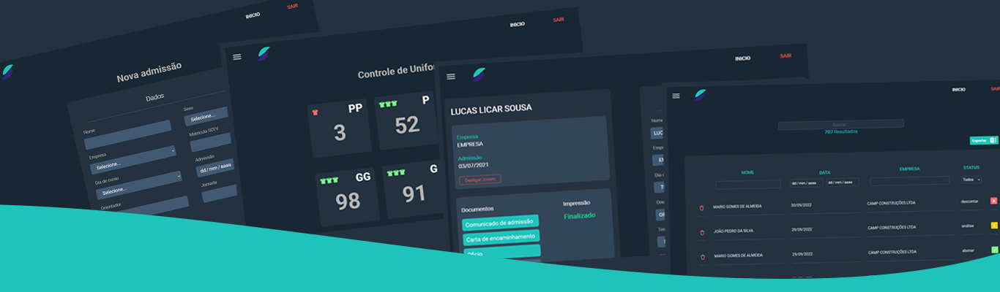

O SISA é um sistema desenvolvido para otimizar alguns processos de gestão de recursos humanos.  
**Totalmente personalizado para atender os processos da instituição no qual eu trabalho atualmente:**  
Associação de Educação do Homem de Amanhã "Guardinha" - *entidade que atua no terceiro setor em diversas áreas de assistencia social,  
como também na Aprendizagem Profissional sendo uma das principais entidades certificadoras de aprendizagem de Campinas.*

### Tecnologias utilizadas:

 - ReactJs
 - NodeJs
 - Mysql
 - Vercel
 - Heroku
 
 ## Funcionalidades
 
  - <b>Registro, consulta e controle de Jovens Aprendizes, Funcionários e Empresas Parceiras.</b>
  
  

     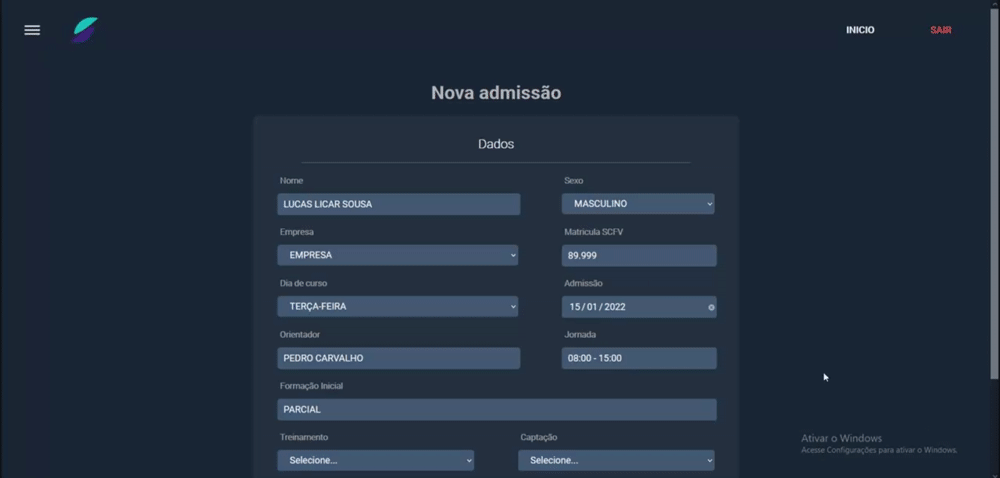
    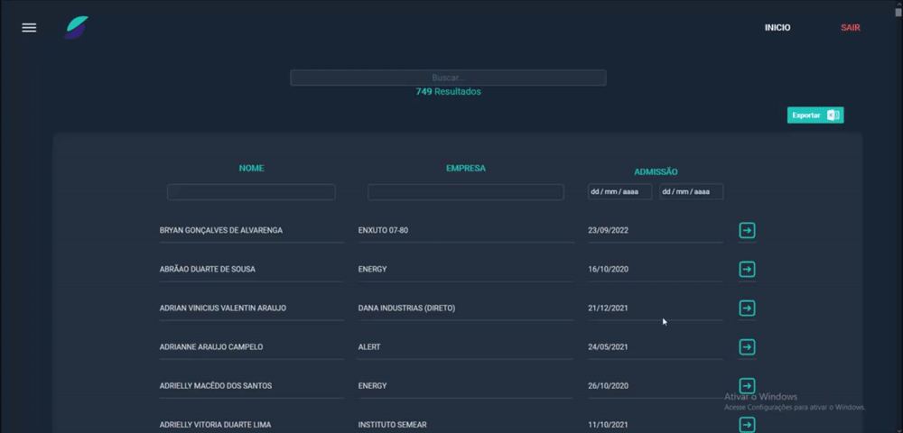
  

   
   
   

  -  <b marginTop="300">Emissão de documentos admissionais com os dados do Jovem Aprendiz</b>
     - *Após o cadastro do aprendiz no sistema, é possivel realizar a emissão dos documentos nescessários para a admissão automaticamente.*
  
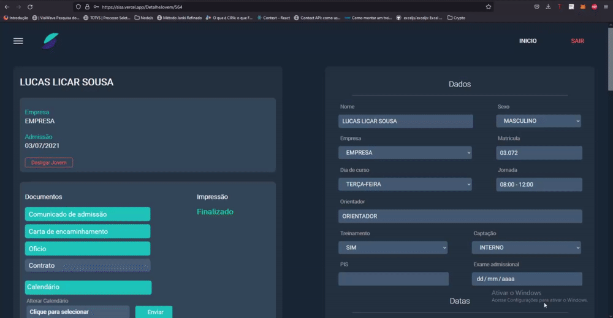
   
   
   
  
  - Controle de ausências de Jovens Aprendizes
     - Registrar e acompanhar as ausencias dos aprendizes.
     
  

     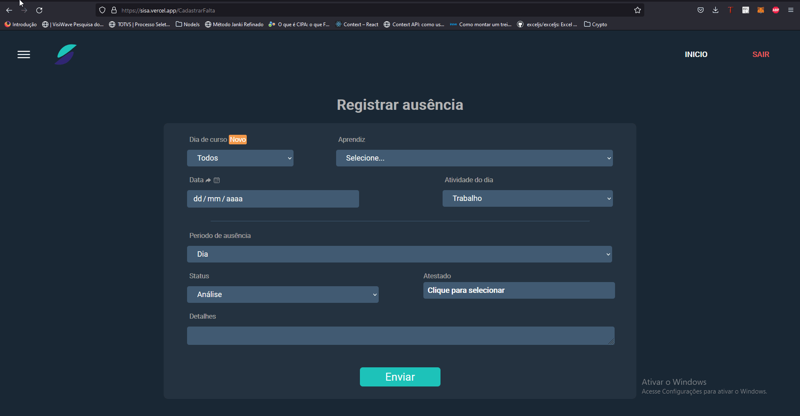
    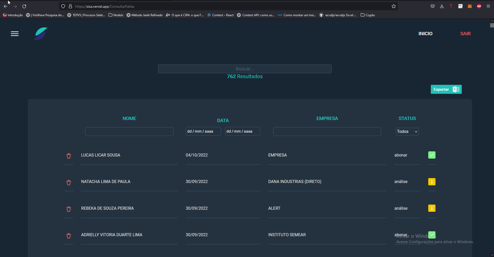
  

  
   
   
   

  - Emissão de relatórios de frequencia mensal.
     
   
  
  - Controle de estoque de uniformes
  

   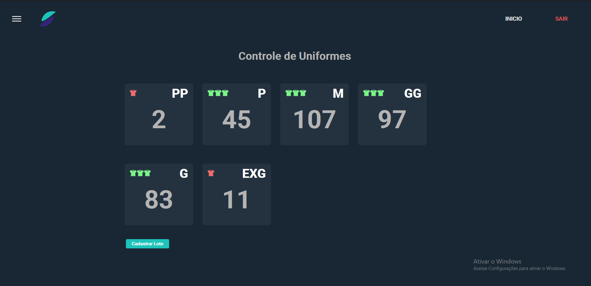
  

   
   
   

  - Lançamento e controle de atestados de colaboradores

  

    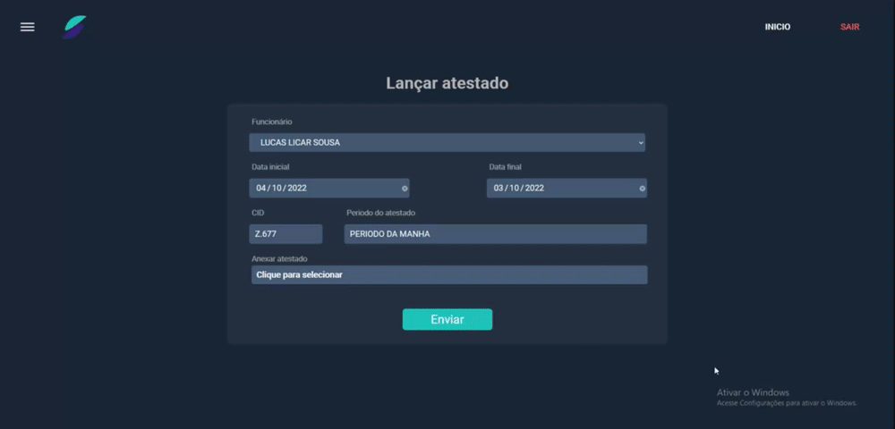
    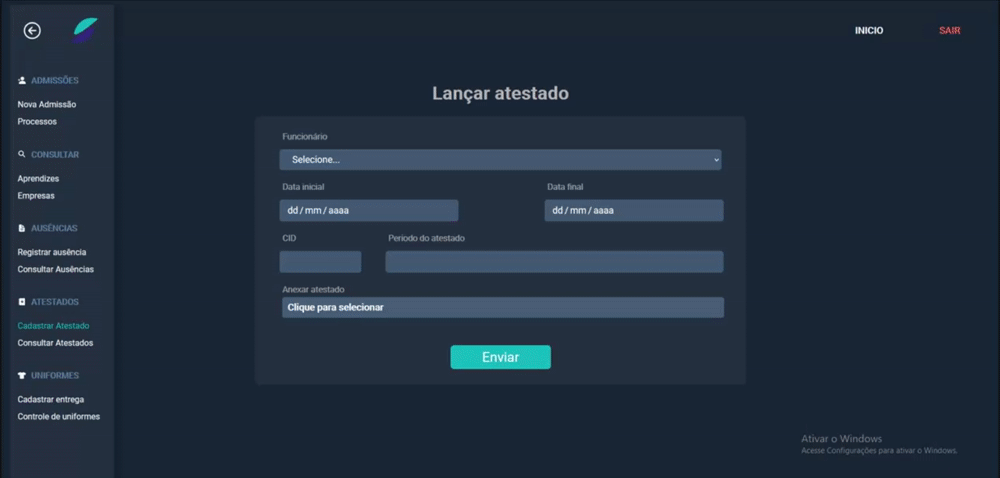
  

   
  

  
  > Todas funcionalidades mencionadas, tem a possibilidade de exportação de dados em excel.
  
  

### Atualizações futuras

 - Carômetro
    - Incluir registro fotográfico de todos os aprendizes, e disponililizar uma área com todas as fotos para facilitar na gestão e orientações das equipes.
  

    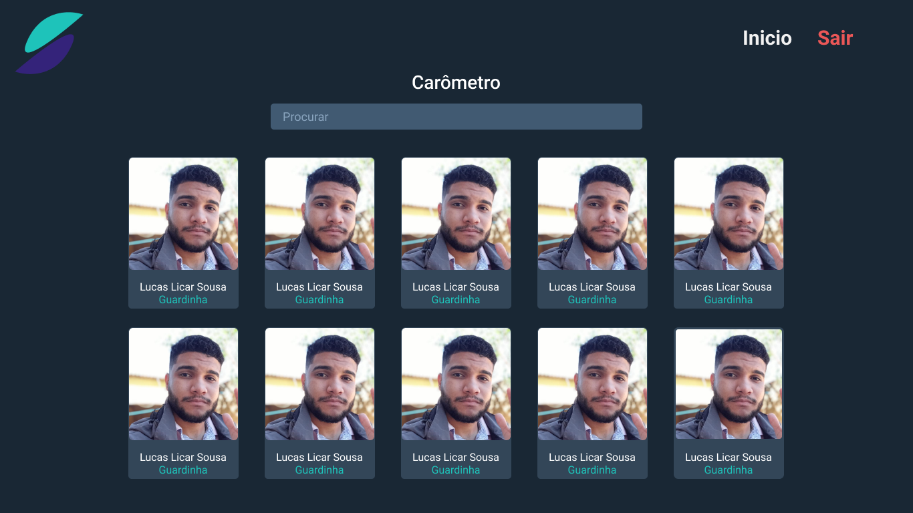
  

  *Protótico Figma*
   
   
   
 - Gestão de atendimentos técnicos
    - Essa área será exclusiva para o registro e acompanhamento de casos técnicos relacionados ao aprendiz .
    

      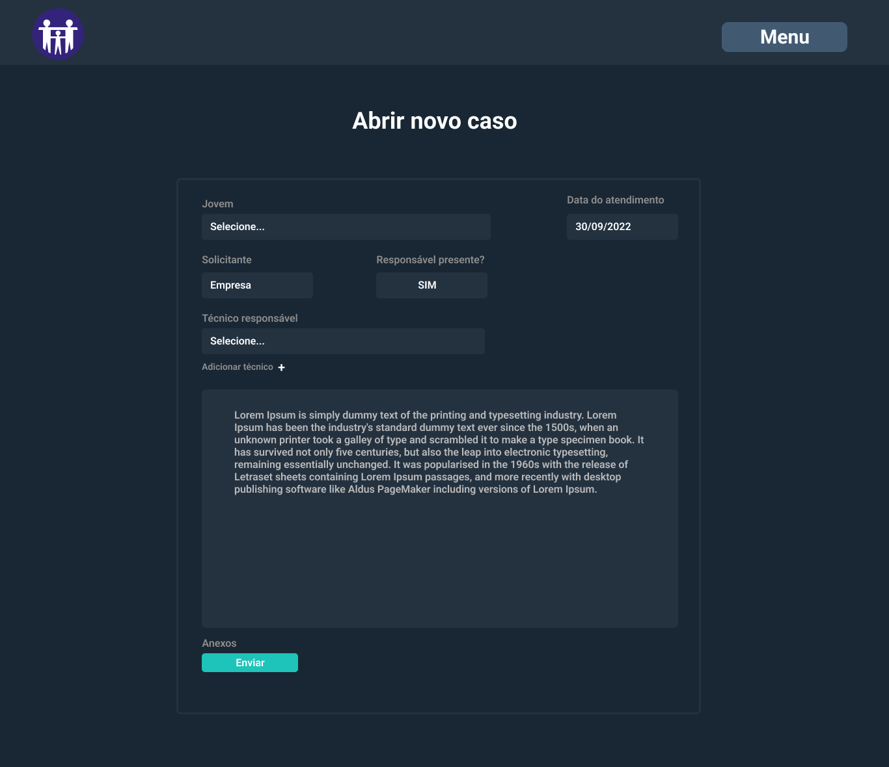
      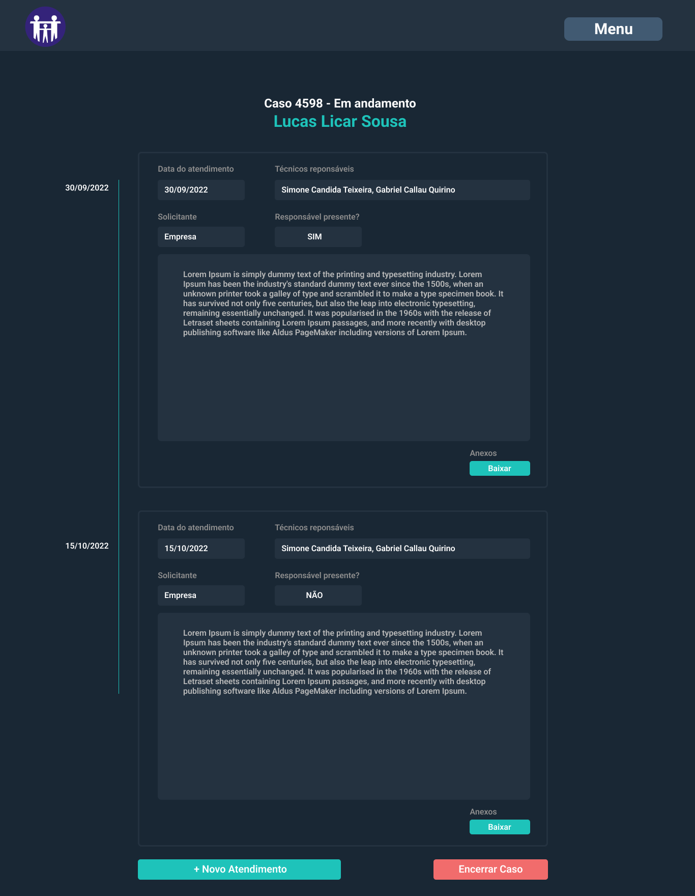
    

    *Protótico Figma*
  

  

 
