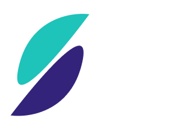
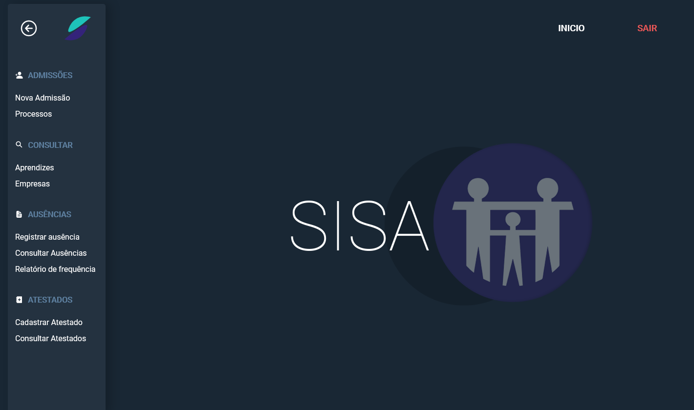

> Sistema de gestão de processos de Recursos Humanos.

 ### Repositórios do projeto
- Backend API NodeJs https://github.com/llicar/sisa-api
- Frontend ReactJs https://github.com/llicar/sisa-app

### Tela inicial 

O SISA é um sistema desenvolvido para otimizar alguns processos de gestão de recursos humanos.  
**Totalmente personalizado para atender os processos da instituição no qual eu trabalho atualmente:**  
Associação de Educação do Homem de Amanhã "Guardinha" - *entidade que atua no terceiro setor em diversas áreas de assistencia social,  
como também na Aprendizagem Profissional sendo uma das principais entidades certificadoras de aprendizagem de Campinas.*

 
